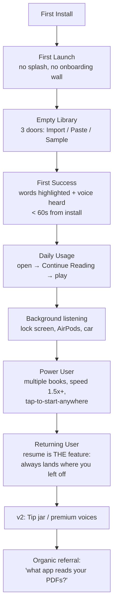
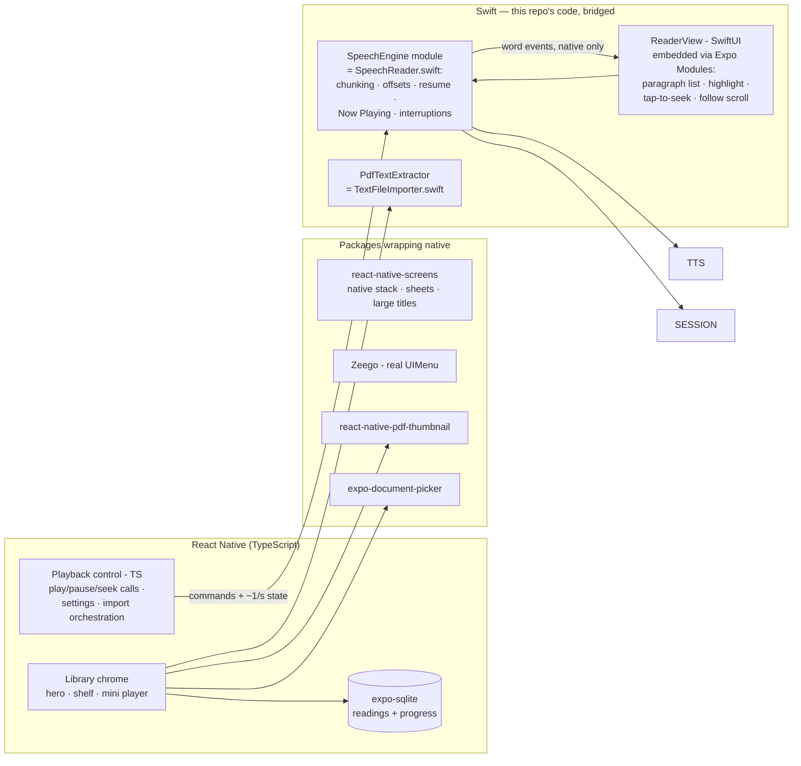

# ReadingLoud — Productization Plan

*Answering `Productization_Prompt.md`, scoped to what this app is: a local,
offline text-to-speech reader. Sections the template assumes (auth, servers,
OTA) are answered honestly — usually "not in v1, here's why."*

---

## 1. User Journey

- **No onboarding screens, no authentication.** There is no account. The app
  works in airplane mode forever. Time-to-first-success is the entire funnel:
  install → hear your own document read aloud in under a minute.
- **First Success** is precisely defined: the user hears a word *and sees it
  highlight*. That moment demonstrates the whole product.
- **Retention driver is the content, not the app.** A 21-hour book *is* the
  streak. Our job is to never lose their place and never make resuming hard.

## 2. Navigation Architecture

- **No tab bar.** One primary object (readings), one primary place (Library).
  A tab bar with one real tab is App Store template smell. Structure:
  - `NavigationStack`: Library → Reader (push)
  - Modal sheets: Composer, Voice & Text settings, About
  - Persistent overlay: Mini player (Library, above content)
  - Context menus: Delete (hero card, shelf items)
- **Toolbar:** `+` (primary action: import; long-press menu: type/paste) and
  gear (settings). Nothing else. Search enters when libraries realistically
  exceed ~20 items (v2), as `.searchable` on the Library, not a tab.
- **Never in a tab bar, ever:** settings, paywall, "profile."

## 3. Screen Architecture

| Screen | Status | Notes |
|---|---|---|
| Splash | **Skip** — iOS launch screen is the splash. Custom splashes only add delay. |
| Onboarding (3 screens) | **Skip** — the empty state *is* onboarding: it teaches (copy), motivates (sample), guides (Import button). |
| Login | **Skip** — no accounts. Nothing to log into. |
| Home / Library | ✅ Built | Continue Reading hero + shelf + mini player |
| Reader (detail) | ✅ Built | Live highlight, tap-to-seek, follow pill, controls |
| Composer | ✅ Built | Type/paste/import with inferred title |
| Settings (Voice & Text) | ✅ Built | Voice, speed, pitch, text size, preview |
| About / Support | **P0 today** | Version, contact, privacy one-liner |
| Paywall | **v2** | See §Monetization — nothing to sell yet |
| What's New / update flows | **Skip** — no server, no OTA. App Store handles updates. Mandatory-update flows are for client-server apps whose APIs break. |

**Settings tree (v1):** Voice (picker + preview) · Speech (speed, pitch) ·
Text (size) · About (version, support mail, privacy). Account/Notifications/
Subscription/Delete-account sections have nothing behind them — shipping empty
settings rows to look complete is exactly the "other apps do it" trap.

## 4. Product Loop

**Cue** — life: commute, gym, dishes; plus the lock-screen Now Playing card
that keeps the book one tap away.
**Action** — open app → hero card → play. Two taps, zero decisions.
**Reward** — progress that *visibly* moves: "18h 32m left" ticking down is a
progress bar on a real goal (finish the book), not an invented one.
**Investment** — every imported document deepens the library; every minute
listened is stored position. Switching apps means losing your place — ours
never does.
**Why return tomorrow?** The book isn't finished. That's the honest loop; the
app's job is to make re-entry frictionless (resume) and exit painless
(background audio, position saved on every pause).

## 5. Incentives

Streaks, achievements, unlockables: **cut.** A utility that guilt-trips you
about missing a day gets deleted. Real incentives, in priority order:
1. **Remaining-time countdown** (built) — the only progress metric that maps
   to a real-world goal.
2. **Finished state** (built) — checkmark, restart affordance.
3. v2: yearly "listening recap" (hours listened, books finished) — shareable,
   private, no server needed.

## 6. Notifications

**v1: none.** No permission prompt at all. A reading app interrupting you to
read is self-defeating; notification permission is social capital we spend
later, if ever. v2 candidate: a single *optional* "continue where you left
off" reminder, off by default, user-scheduled.

## 7. Toolbar

Library: `+` (import primary / menu secondary), gear. Reader: voice settings.
No overflow menus — if an action doesn't fit, it doesn't exist yet. No FABs;
they're Android furniture.

## 8. Empty States

- Library (built): teaches what the app does, offers Import / Paste / Sample.
- Search results (v2): "No matches for X."
- Voice list empty: impossible on iOS (system always ships voices).

## 9. Error States

| State | Treatment |
|---|---|
| Offline | Non-event. Everything is local. Never show a network error because there is no network. |
| Import failed (unreadable, no text layer, empty) | ✅ Built — alert with the specific reason, partial batches still import |
| Scanned PDF (no text layer) | ✅ Detected — explains OCR is needed rather than importing silence |
| Voice unavailable / deleted | Fall back to system default silently, note in settings |
| Audio interruption (call, Siri) | **P0 today** — pause, resume after if brief |
| Loading (large PDF) | ✅ Built — blocking progress card |
| Server / auth / payment / update errors | N/A — no server, no auth, no payments in v1 |

## 10. Design System

Deliberately: **system everything.** SF Pro for UI; New York (serif) for
reading text and cover fallbacks. Spacing on the 4pt grid (12/14/16/20).
Dark-first (artwork-led). Corner radii: 14 (cards), 18 (mini player), 9
(shelf covers), capsule (controls). Color: system blue accent, white-opacity
scales on dark, one deterministic hue per coverless reading. Components:
system List/Form/Sheets/ContextMenu; custom only where the product is:
ContinueReadingCard, ShelfItem, MiniPlayerBar, ReadingArtwork, ProgressTrack,
paragraph highlighter. Nothing else gets invented.

## 11. Product Polish (the honest 100 → the meaningful 12)

A hundred bullet points would be padding. The dozen that matter, ordered:
1. Background audio + lock screen Now Playing + remote commands **(P0)**
2. Audio interruption handling (calls, Siri, route changes) **(P0)**
3. App icon **(P0)**
4. Persist position when app is backgrounded/killed **(P0)**
5. Haptic on play/pause and on finish (light impact)
6. Skip ±15s / previous-next paragraph on lock screen (v1.1)
7. Scrub by chapter/section once header detection exists (v1.1)
8. Sleep timer (v1.1 — bedtime listening is a core audiobook behavior)
9. Share-sheet extension: "Read in ReadingLoud" from Safari/Notes (v2)
10. Header/footer stripping for PDFs (v1.1, quality-of-listening)
11. Undo after delete (snackbar, 5s)
12. VoiceOver audit of custom controls (labels exist; needs a pass)

## 12. Growth

No referral mechanics in a local utility — the growth loop is **the app being
visibly useful in public**: Now Playing on the lock screen, AirPods
announcements, "what app is that?" North-star metric: **hours listened per
weekly active user.** Activation: % of installs that play ≥60s on day one.
Retention: % returning to the *same document* within 7 days. All measurable
later with privacy-safe local analytics (v2, opt-in), none of it blocking v1.

## 13. Engineering

- **Structure:** flat target, files by feature (`Reading`, `SpeechReader`,
  `ReaderView`, …). Modularize only when a second target (share extension,
  widget) forces it — that's v2, via a small `ReadingKit` framework for
  model + importer.
- **State:** `@Observable` SpeechReader as the single playback authority
  (already true); SwiftData for persistence; no additional state framework.
- **Analytics / crash reporting:** v1 ships with none (privacy is the brand).
  v2: MetricKit first (free, private), then opt-in analytics if ever.
- **Remote config / A/B / OTA:** No. Local app, App Store releases only.

## 13b. React Native Migration

Decision: the app moves to React Native. The split follows one rule, set by
the founder — **if an existing, maintained package covers a capability, use
the package; write a Swift bridge only where the ecosystem has no answer.**

### Package audit (capability by capability)

Founder decision: the app is React Native, and **the existing, debugged Swift
code is itself the "existing package"** — we bridge it rather than porting
its logic to TypeScript or adopting `react-native-tts`. The package-first
rule still governs everything that *doesn't* already exist in this repo.

| Capability | Today (Swift) | RN ecosystem answer | Verdict |
|---|---|---|---|
| Speech engine: synthesis, chunking, offsets, resume, word events | `SpeechReader` — written, debugged, harness-tested | `react-native-tts` exists but only reports events to the JS thread, putting JS in the 10/s highlight hot path | **Bridge our Swift engine** (Expo Modules). Word events go native→native to the reader view; JS receives only low-frequency state/progress (~1/s). No TS port, no event-fidelity spike |
| Now Playing, remote commands, interruptions | (P0, being written) | wrong-shaped (`react-native-track-player`) or stale (`react-native-music-control`) packages | **Inside the engine module** — the session logic lives beside synthesis where it belongs |
| PDF text extraction + reflow | PDFKit, 613 pages in 0.88s | `react-native-pdf` is a viewer; `pdf-lib` doesn't extract; pdf.js on Hermes is slow and polyfill-ridden for 600-page books | **Bridge `TextFileImporter`.** (Android twin later: PdfBox-Android) |
| PDF cover thumbnail | CoreGraphics render | **`react-native-pdf-thumbnail`** — native first-page render, both platforms | **Package** |
| Lock screen / remote commands | (P0, in flight) | `react-native-track-player` is file-player-shaped, wrong fit for TTS; `react-native-music-control` fits but is stale | **Thin Swift shim** — MPNowPlayingInfoCenter + MPRemoteCommandCenter + AVAudioSession interruptions, ~150 lines, driven from JS |
| File picking | `.fileImporter` | **`expo-document-picker`** | **Package** |
| Persistence | SwiftData | **`expo-sqlite`** (or WatermelonDB if lists grow) | **Package.** Covers become files, not BLOBs |
| Reader view + live highlight | SwiftUI paragraph list | FlashList could approximate it, but no package gives the native text stack | **SwiftUI, embedded** — kept native per the UI principle below; today's paragraph list ships as an Expo Modules SwiftUI view |
| Navigation, large titles, push/pop | `NavigationStack` | **`react-native-screens` native stack** — real `UINavigationController` | **Package (wraps native)** |
| Sheets (composer, settings) | `.sheet` | **native-stack `formSheet`** — real `UISheetPresentationController` | **Package (wraps native)** |
| Context menus (delete) | `.contextMenu` | **Zeego** — real `UIMenu`, not a JS lookalike | **Package (wraps native)** |
| Background audio | `UIBackgroundModes` | `app.json` infoPlist entry | **Config, no code** |

### Voice parity — total, by construction

The engine in the RN app **is this repo's `SpeechReader`**, bridged, not
reimplemented. Diction, voice catalog (incl. downloaded Enhanced/Premium),
rate scale, pitch, word-boundary pause, chunk seams, offset math — all carry
over unchanged because the code carries over unchanged. Rate values persist
on AVFoundation's own 0–1 scale; no mapping layer exists to get wrong. Full
`AVSpeechUtterance` access is retained, so future features (per-word IPA
pronunciation overrides) stay possible. The only parity work left is
Android's future Kotlin engine, which implements the same module interface.

### UI principle

**Keep the UI native as much as possible.** Concretely, in priority order:
1. Where a package wraps the real UIKit thing (navigation, sheets, menus,
   symbols, haptics), use that package — never a JS re-implementation that
   imitates iOS.
2. Where the surface is ours and interaction-heavy — **the reader** — embed
   SwiftUI directly (Expo Modules API hosts SwiftUI views as RN components
   with props/events). Today's `ReaderView` paragraph list, highlight math,
   and follow-mode scroll carry over nearly verbatim.
3. Only the custom artwork chrome (hero card, shelf, mini player) is plain RN
   views — there is no native widget being imitated there, it's images and
   text, so nothing is lost.

**Net native surface: three Swift pieces, all already written in this repo**
— `SpeechEngine` (SpeechReader + session/Now Playing), `ReaderView`
(paragraph list + highlighting), `PdfTextExtractor` (TextFileImporter).
The bridge carries only low-frequency traffic: commands down, ~1/s
state/progress up for the mini player. **Word events never cross the
bridge** — the engine posts them natively (NotificationCenter) and the
embedded reader view subscribes natively, so the 10/s highlight path has no
JS-thread dependency and cannot hiccup when JS is busy. No spike gates the
plan anymore; the risky assumption was removed by reusing proven code.

**Persistence:** SwiftData is Swift-only, so the store becomes SQLite —
`readings(title, text, cover_path, progress_offset, word_count, snippet,
created_at, last_opened_at)`, covers as files, one-time migration importing
the existing SwiftData store.

**Tooling:** Expo with a dev client + config plugins (prebuild) — custom
native modules work under prebuild and the Expo toolchain stays.
`UIBackgroundModes: audio` via `app.json`.

**Phased, so the app never stops working:**
1. **P0s land in the Swift app first** (background audio, Now Playing,
   interruptions, icon, progress flush). The Now Playing/interruption code is
   written as the future `PlaybackSessionShim`, so it survives the migration.
2. **Extract `ReadingKit`** — SpeechReader + TextFileImporter + highlight
   math as a local Swift package with zero SwiftUI imports. Today's app
   keeps using it; the RN modules wrap it.
3. RN workspace: Expo Modules wrappers — `SpeechEngine` (commands in,
   ~1/s state out, native word-event notifications), `PdfTextExtractor`,
   `ReaderView` (SwiftUI view, props `{text, fontSize}`, event
   `onSeek(offset)`); SQLite schema + one-time SwiftData migration.
4. Rebuild the library chrome and settings in RN (native stack, native
   sheets, Zeego menus); ship at parity; delete the SwiftUI shell only then.

**Costs, stated plainly:** Android is a real second project — a Kotlin
engine implementing the same module interface (Android TTS has no pause and
coarser word events; our resume-from-offset design absorbs both), plus
PdfBox-Android for extraction. Budget it as a rewrite of the native layer,
not a port. And the store date moves: the RN rewrite is weeks, which is why
phase 1 ships the Swift app first.

## 14. Roadmap

**v1 (this submission):** everything built + P0 list above + App Store
metadata. **v1.1:** header/footer stripping, sleep timer, ±15s skips,
chapter detection, undo delete. **v2:** share extension, iCloud sync of
library + positions, premium voice pack or tip jar, listening recap, search.
**v3:** OCR for scanned PDFs, EPUB, widgets/Live Activity, CarPlay.

**Monetization (v2, honest):** the sellable thing is *quality voices*
(downloadable premium neural voices) and *sync*. One-time unlock or small
subscription. v1 ships free with zero IAP — build the review base first.

---

## 15. Design References (Mobbin)

The visual target, screen by screen. Each link is the canonical reference;
"take" is what to copy, "skip" is what not to.

| Our screen | Reference | Take | Skip |
|---|---|---|---|
| **Reader** | [Apple Podcasts transcript player](https://mobbin.com/screens/416723d1-24a7-4c15-b7c3-fb21d53d44ae) | Text *is* the artwork: background tinted from the cover, past text dimmed, current position bright, future text faded. Controls float at the bottom. We already have word-level precision (they only do sentences) — wrap it in this treatment | Their karaoke-style full-bleed color; keep our serif reading column |
| **Reader controls** | [ElevenReader reader](https://mobbin.com/screens/26aca08b-79f8-437d-bf44-613fc27b74d5) | One control row only: sleep · −15 · play/pause · +30 · speed · voice. No stop, no restart — fewer, better controls | Their light theme |
| **Hero card** | [Apple Books Home](https://mobbin.com/screens/fa54930d-72ec-44e1-b65d-f8b50aa6e173) | Compact "Continue" card: small cover thumbnail, "Book · 99%", **Mark as Finished** inline action. The hero earns its place at ~120pt, not 260pt | Their store shelves |
| **Library rows** | [Headway list](https://mobbin.com/screens/efefb9b3-d5d5-468f-b17e-1a447e089e00) | Thin progress bar directly under each title — progress as a glance, not a number | Download buttons, overflow dots per row |
| **Import** | [Speechify Home](https://mobbin.com/screens/6417e2fe-98b9-4616-9ce9-c374a3a05523) | The home-as-import-grid idea, scaled down: our empty state and `+` menu grow into a source grid (Files · Paste · Scan · Link) as sources are added | Making import the *whole* home once a library exists |
| **Mini player / progress copy** | [Spotify audiobook player](https://mobbin.com/screens/c9cb0602-c90a-4e10-9e03-14be4407c20c) | The progress string: **"3hrs 43min left · 1% complete"** — remaining + percent in one line. Cover-tinted player background | Social/share rows |

**Synthesis:** Speechify's import-first structure + Apple Books' compact
continue card + Apple Podcasts' tinted immersive reader + ElevenReader's
minimal control row — all dark, artwork-led, resume-first.

## 16. Implementation Brief (start here in a fresh repo)

Build order, RN workspace (Expo prebuild + dev client):

1. **Scaffold:** Expo app, TypeScript, `react-native-screens` native stack,
   expo-sqlite. Dark theme root. `UIBackgroundModes: ["audio"]` in app.json.
2. **Vendored Swift:** copy `SpeechReader.swift`, `TextFileImporter.swift`,
   `TextHighlighting.swift`, `ReaderView.swift` from this repo into the
   native module package. They are the implementation; do not rewrite them.
3. **Data layer:** `readings` table
   (`id, title, text, cover_path, progress_offset, word_count, snippet,
   created_at, last_opened_at`). Covers are files, never BLOBs.
   **List queries must never SELECT `text`** (see §17.9).
4. **Native module 1 — SpeechEngine (Expo Modules):** wraps `SpeechReader`.
   JS API: `play(id, text, offset)`, `pause()`, `resume()`, `stop()`,
   `setRate/Pitch/Voice`, `getVoices()`. Events to JS: `onState`,
   `onProgress` throttled to ~1/s (mini player only). Word ranges are
   posted via `NotificationCenter` natively — **never emitted to JS**.
   Extend with the P0 session work: AVAudioSession (.playback/.spokenAudio),
   MPNowPlayingInfoCenter (throttled, cached artwork), remote commands,
   interruption + route-change observers.
5. **Native module 2 — PdfTextExtractor:** wraps `TextFileImporter`.
   API: `extract(uri) → {title, text, coverPath}`.
6. **Reader (SwiftUI via Expo Modules):** `ReaderView` + `TextHighlighting`
   as an embedded view — paragraph list, per-paragraph equatable rendering,
   binary-search current paragraph, follow-mode scroll + Follow pill,
   tap-paragraph-to-seek. Props: `{readingId, text, fontSize}`; event up:
   `onSeek(offset)`. It subscribes to the engine's word notifications
   natively; JS is not in the highlight path.
7. **Library:** hero card (compact, §15) + shelf + mini player, Zeego
   context menus, expo-document-picker import flow with busy overlay and
   per-file error alert.
8. **Polish pass:** haptics on play/pause/finish, sleep timer, ±15s,
   undo-delete snackbar, VoiceOver labels on every custom control.

## 17. Known Pitfalls & Potential Bugs

*Every numbered item below was either hit and fixed in this repo, or is a
predictable failure of the target stack. Read before implementing.*

**Speech engine**
1. **Offsets are UTF-16 and utterance-relative.** `willSpeakRangeOfSpeechString`
   (and `tts-progress`) report ranges relative to the *utterance string*, not
   your document. Playing from mid-document or chunking means every range
   must be rebased: `globalOffset = chunkBase + range.location`. Miss this
   and highlights drift after the first seek/chunk seam.
2. **Ranges can land inside surrogate pairs.** Emoji and some scripts occupy
   two UTF-16 units. Slicing a Swift String at a raw UTF-16 offset traps or
   returns nil (`samePosition`); clamp to character boundaries and widen.
   (JS strings are UTF-16 natively, so the TS port is safer — but slicing
   can still split a pair and render broken glyphs.)
3. **Never feed the whole book to one utterance.** 1.4MB in a single
   `AVSpeechUtterance` = 2.2s of silence before the first word — and rate
   changes restart the utterance, so users pay it repeatedly. Chunk ~3,000
   units at sentence boundaries, queue 2 ahead (gapless), cut mid-sentence
   only after +1,000 overshoot. Measured result: 0.88s → first word, flat
   in document size.
4. **Rate/pitch/voice are locked per utterance.** Live speed change =
   cancel + resume from current offset with new settings. With chunking
   that re-synthesizes ~a page, which feels instant; without it, seconds.
5. **Cancellation races.** Stopping fires `didCancel` for every queued
   utterance, *after* you've already started the next playback. Tag each
   utterance with a generation counter and drop callbacks from old
   generations, or stale events corrupt fresh state.
6. **Delegate/event threading.** AVSpeech delegate callbacks are not
   guaranteed on main; RN events arrive on the JS thread. Hop before
   touching UI state; keep the per-word handler allocation-free.
7. **A deleted voice identifier returns nil.** Users can remove downloaded
   voices in iOS Settings. `AVSpeechSynthesisVoice(identifier:)` → nil →
   fall back to system default silently, don't crash or alert.

**Persistence & performance**
8. **Never write progress per word event.** 10 writes/sec dirtying a
   multi-MB row froze scrolling in this repo. Throttle to ~1,000 chars of
   advancement + flush exactly on pause/stop/finish/background. Losing the
   flush on app-kill loses up to one stride of progress — acceptable;
   losing more is not.
9. **Never load `text` for list views.** Computed `wordCount`/`snippet`
   re-splitting 1.4MB on every row render was the single biggest jank
   source found here. Derive at import, store, and in SQLite exclude the
   `text` column from every list SELECT.
10. **Only the active paragraph may re-render on highlight.** Give each
    paragraph stable inputs (nil highlight unless the word is inside it) +
    memo/Equatable. Find the current paragraph by binary search over
    precomputed offsets (9,105-item linear scans, 10×/sec, add up).
11. **Auto-scroll must yield to the user.** Centering the spoken paragraph
    during a user drag feels like the app fighting back. Disengage follow
    on scroll-begin, offer a "Follow" pill to re-engage.

**Import**
12. **PDF text is hard-wrapped.** Every visual line ends in `\n`; naive
    splitting makes each line a paragraph. Reflow: rejoin lines, merge
    hyphenated line-breaks (`inter-\nnal` → `internal`), keep breaks after
    sentence-ending punctuation and blank lines.
13. **Scanned PDFs have no text layer.** `page.string` returns nil/empty.
    Detect and refuse with an explanation (needs OCR) — importing silence
    looks like a crash to users.
14. **Headers/footers get read aloud.** Running heads and page numbers
    survive extraction and interrupt listening mid-sentence, every page,
    for 21 hours. Strip lines repeating across many pages (v1.1 here; do it
    from day one in the new repo).
15. **Text files aren't all UTF-8.** Fallback chain: UTF-8 → declared
    encoding sniff → Latin-1 (never fails). Straight
    `String(contentsOf:encoding:.utf8)` throws on plenty of real files.
16. **Picker URLs are security-scoped.** `startAccessingSecurityScopedResource`
    + deferred stop, or reads fail only outside the simulator — the worst
    kind of works-on-my-machine.
17. **Extract off the main thread and show a busy state** — 613 pages takes
    ~1s native (and pdf.js on Hermes is far slower; don't extract in JS).

**Audio session / lock screen**
18. **No `UIBackgroundModes: audio` = playback dies on lock.** The app's
    core use case fails silently. Also set session `.playback` +
    `.spokenAudio` — default category is silenced by the ring switch.
19. **Handle interruptions or calls kill sessions permanently.** Observe
    interruption began → pause; ended + `.shouldResume` → resume.
    Deactivate with `.notifyOthersOnDeactivation` so background music
    returns to other apps.
20. **Throttle Now Playing updates and cache artwork.** Rebuilding
    `MPMediaItemArtwork` from PNG data per word event is a memory churn
    machine. Build once per reading; update elapsed/rate ~1/sec.

**UI details that read as bugs**
21. **"0% read"** — round-to-zero progress text looks broken; show the
    stat only ≥0.5%.
22. **Deterministic fallback-cover colors** — Swift `hashValue` is
    per-launch seeded (and JS has no stable default hash); use djb2 or
    similar, or covers change color every launch.
23. **Title duplication** — generated typographic covers print the title,
    and the card overlays it again. Real PDF covers don't collide; only
    style generated covers with the title if no overlay text sits on top.
24. **Landscape covers in landscape cards crop the title band** — decide
    the crop (taller card / top-anchor / blur-behind) deliberately.
25. **Preview ≠ device:** Xcode Previews (and Expo Go) can't host the
    document picker, pasteboard, or background audio — those paths need a
    real build on a device/simulator. Simulator's Files app may need a
    visit before newly-added files appear in the picker.

## 18. Design Tokens (exact values from the current build)

An RN repo can't read these out of SwiftUI, so here they are:

- **Ground:** pure black. Cards: white 0.10→0.03 gradient fill, 0.08 white
  hairline stroke. Radii: hero 14 · mini player 18 · shelf covers 9 ·
  cover thumbnails 5–7 · controls capsule.
- **Cover aspect:** 1:1.42 (trade paperback). Sizes: shelf 128pt wide,
  hero thumb 74, mini player 34.
- **Type:** SF Pro for UI; serif (New York) for reading text and generated
  covers. Reader default 19pt, range 14–34, line spacing 0.35×.
- **White-opacity scale:** primary 1.0 · secondary 0.78 · inactive 0.55 ·
  highlight fill 0.12 · strokes 0.08. Word highlight: accent at 0.28 over
  the text.
- **Hero scrim:** black 0.0 → 0.55 → 0.88 at stops 0.30 / 0.62 / 1.0.
- **Progress tracks:** heights 2 (mini) / 3 (cards) / 5 (resume-style);
  white 0.92 on white 0.16–0.18; entrance: scaleX 0→1, ease-out 280ms,
  disabled under reduced-motion.
- **Spacing grid:** 12 / 14 / 16 / 20. Screen margins 20, card padding 16.
- **Fallback-cover palette:** djb2(title) % 360 → hue; two-stop gradient
  (sat 0.52 bri 0.46 → sat 0.60 bri 0.26).
- **Motion:** entrances ease-out ≤300ms; picker-style highlight slides
  250ms cubic-bezier(0.23, 1, 0.32, 1); variant/content swaps instant.

## 19. Open Decisions (decide these, don't let an agent guess)

1. **±15s skip semantics.** TTS has no timeline — time must be converted to
   text. At ~180wpm ≈ 18 UTF-16 units/sec, 15s ≈ 270 units.
   **Recommendation:** jump ±270 units, snapped outward to the nearest
   sentence start; forward skip lands mid-sentence never.
2. **Sleep timer semantics.** Fire → finish the current sentence, then
   pause (not hard-stop; position already persisted). Durations 5/15/30/60
   + "end of section" once header detection exists.
3. **Hero crop** (§17.24): taller card vs top-anchored crop vs
   blur-behind. Still undecided; Apple Books' compact card (§15) may
   dissolve the question by shrinking the artwork.
4. **Mark-as-Finished** placement: hero inline action (per Apple Books) vs
   context menu only.
5. **Import size cap.** Nothing stops a 200MB text file today. Suggest:
   warn > 5MB of text (~9 days of audio), refuse > 20MB.

## 20. App Store Submission Checklist (the part only a human can do)

- Real bundle ID (reverse-DNS, not `armstrong.ReadingLoud`) + team +
  signing; version/build numbers.
- 1024pt icon (no alpha, no rounded corners in the asset).
- **Privacy nutrition label: "Data Not Collected"** — truthful today: no
  network calls, no analytics, no third-party SDKs. Revisit if that changes.
- `ITSAppUsesNonExemptEncryption = NO` (no custom crypto, no networking).
- No permission strings needed: no camera/mic/location/photos; document
  picker and speech synthesis require none.
- Privacy policy URL — required even for no-data apps. One page, station91.in.
- Support URL (a mailto is not accepted).
- Screenshots: 6.9" and 6.5" sets; shoot Library-with-content, Reader
  mid-highlight, lock screen with Now Playing.
- Age rating questionnaire (everything "no" → 4+). Note user-imported
  content is out of scope for rating.
- App Review notes: attach a small public-domain .txt and .pdf and describe
  the 60-second happy path (import → play → lock the device).

## 21. Acceptance Tests (port these; they caught real bugs here)

Each of these exists as a working harness in this repo's history and found
at least one genuine defect. Re-run them against the new implementation:

1. **Offset round-trip.** Split any document into paragraphs; rejoining
   with `\n` must equal the source exactly, and every paragraph's
   `[start, end)` slice of the full text must equal its own text. Run on a
   600-page extraction, not a toy string.
2. **Chunk reassembly.** Concatenating all playback chunks must reproduce
   the document byte-for-byte — no gaps, no overlaps, progress guaranteed
   on every iteration (a non-advancing chunk = infinite loop).
3. **Live-synthesizer probe.** Speak from a mid-document offset with a
   muted synthesizer at max rate; assert every reported range (a) stays
   within `[startOffset, total)`, (b) matches its substring, (c) highlights
   exactly one paragraph. Include `café`, `naïve`, an emoji, and a chunk
   seam in the fixture.
4. **Performance gates.** 600-page PDF: extraction < 3s off-main;
   time-to-first-word < 1.5s; changing speed mid-book audibly restarts in
   < 1s. Scroll during playback: no dropped-frame bursts in Instruments.
5. **Resume integrity.** play → wait → stop → relaunch → play resumes
   within one persist-stride of where audio stopped; pause/stop/background
   each flush exactly.
6. **Session survival.** Lock the device 10 minutes: audio continues, Now
   Playing shows correct state, remote pause/play work. Take a phone call:
   playback pauses and resumes after.
7. **Import failure matrix.** Scanned PDF → "needs OCR" error; empty file →
   "no text"; Latin-1 file → imports; 3-file batch with one bad file →
   two succeed, one named error.

## POC Critique (as requested: not polite)

1. **Playback dies when the phone locks.** For a 21-hour audiobook this is
   not a bug, it's the absence of the product. No `UIBackgroundModes: audio`,
   no Now Playing, no remote commands: Apple reviewers and users will both
   treat this as broken. *(fixed today)*
2. **A phone call kills your listening session silently.** No interruption
   handling; position safe, but playback never resumes. *(fixed today)*
3. **The app has no icon.** Cannot submit. *(fixed today)*
4. **Force-quit loses up to 1,000 characters of progress.** Throttled writes
   without a lifecycle flush. *(fixed today)*
5. **The hero card crops the book title off** and then repeats the title as
   overlay text — the layout is fighting its own artwork. Needs the taller
   card or top-anchored crop decision.
6. **21 hours of audio with no navigation** — no chapters, no scrubbing, no
   ±15s. Losing your place means scrolling 9,105 paragraphs.
7. **Page headers/footers are read aloud** mid-sentence. "Chapter 2 | 33"
   every page for 21 hours is disqualifying for the core use case.
8. **Delete is hidden** behind a long-press with no undo.
9. **No sleep timer** — table stakes for the bedtime half of audiobook usage.
10. **Voice quality defaults to compact Samantha** — the app never tells
    users that far better voices are a Settings download away.
11. **`armstrong.ReadingLoud` bundle ID** and no team configured — fine
    locally, must be a real reverse-DNS + team before archive.
12. **Zero accessibility audit** on custom controls (tap-to-seek paragraphs,
    progress tracks, mini player) — some have labels, none are tested.
